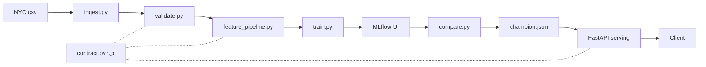

# 🚗 nyc-ride-eta-pipeline

An end-to-end ML pipeline for predicting trip durations in NYC.

## 📌 Project Overview

This project implements a production-ready ML system including data validation, a robust feature engineering pipeline, model experimentation tracking with MLflow, a REST API for real-time predictions, and automated monitoring with drift detection and retraining triggers.

## Team

- **Nidhi Sharma**
- **Kapil Chhabra**
- **Ronak Shah**

## Tech Stack

- **Language:** Python 3.11
- **Data Engineering:** Pandas, PyArrow (Parquet)
- **ML Pipeline:** Scikit-Learn
- **Experiment Tracking:** MLflow
- **Data Contract:** `src/contract.py` (shared bounds/feature lists across validation, training, serving)
- **Models:** XGBoost, LightGBM, CatBoost
- **Serving:** FastAPI, Uvicorn, Docker
- **Testing:** pytest (15 tests: valid requests + input validation)
- **Data Versioning:** DVC

## 🚀 Getting Started

### 1. Setup Environment

```bash
python -m venv .venv
.\venv\Scripts\activate
pip install -r requirements.txt
dvc init
```

### 2. Run Data Pipeline (with DVC Slicing)

The preprocessing script accepts an optional `--end-month` argument to simulate staged data ingestion (e.g., data arriving month-by-month).

**Full Dataset (Default):**

```bash
python -m src.data.preprocess
```

**Time-based Slicing:**

```bash
# Slice v1: Jan 2016 only
python -m src.data.preprocess --end-month 1

# Slice v2: Jan–Mar 2016
python -m src.data.preprocess --end-month 3
```

### 3. Version Data & Models (DVC)

After running the pipeline, snapshot the processed artifacts into DVC, then commit the pointer files to Git:

```bash
dvc add data/processed/X_train.parquet data/processed/y_train.parquet models/feature_pipeline.pkl
git add data/processed/*.dvc models/*.dvc data/contracts/feature_registry.json
git commit -m "feat(dvc): versioned dataset slice"
```

### 4. Train Models

Train the baseline and all advanced models on the currently active dataset.
*Note: The training script uses a strictly chronological 80/20 split to prevent future data leakage (M2 rule). MLflow logs are stored in a lightweight SQLite database (`mlflow.db`), which is ignored by Git.*

**Train all models (Ridge, XGBoost, LightGBM, CatBoost):**

```bash
python -m src.models.train --model all
```

**Train a single model:**

```bash
python -m src.models.train --model ridge
python -m src.models.train --model xgboost
```

### 5. Compare Models & Select Champion

Compare all trained MLflow runs and promote the best model:

```bash
# Rank all runs by MAE (lower is better)
python -m src.models.compare --metric mae

# Rank by R2 (higher is better — use --no-ascending or omit --ascending)
python -m src.models.compare --metric r2 --ascending

# Promote the best run as the champion model
python -m src.models.registry
```

The promotion step now exports both serving artifacts used in deployment:

- `models/champion.json` (champion metadata)
- `models/serving/model.pkl` (single champion model artifact used by the API image)

If you want model promotion to be reproducible across machines, version the
promoted serving model with DVC and commit the pointer:

```bash
dvc add models/serving/model.pkl
git add models/serving/model.pkl.dvc models/champion.json
git commit -m "feat(model): promote champion serving artifact"
```

Verify the serving artifact exists before container builds:

```bash
ls models/serving/model.pkl
```

**Performance Summary (Full Dataset):**

| Model | MAE | RMSE | R² |
| ----- | --: | --: | --: |
| Ridge (Baseline) | 292.80s | 443.03s | 0.6148 |
| XGBoost | 245.11s | 384.68s | 0.7096 |
| LightGBM | 245.07s | 384.64s | 0.7097 |
| CatBoost | 246.17s | 386.22s | 0.7073 |
| **Champion**(LightGBM) | 245.07s | 384.64s | 0.7097 |

*Boosting models outperform Ridge baseline by ~16% on MAE. LightGBM and XGBoost are nearly tied; LightGBM edges ahead by 0.04s.*

### 6. View Experiment History

```bash
mlflow ui --backend-store-uri sqlite:///mlflow.db
```

*(Open <http://127.0.0.1:5000> in your browser)*

### 7. Start API

Start the FastAPI server (loads champion model at startup):

```bash
python -m uvicorn src.serving.api:app --reload
```

*(Open <http://127.0.0.1:8000/docs> for Swagger UI)*

**Endpoints:**

- `GET /health` — Health check
- `GET /model-info` — Champion model metadata (type, metrics, run ID)
- `POST /predict` — Single trip ETA prediction
- `POST /predict/batch` — Batch predictions (up to 100 trips)

**Example Prediction Request:**

```json
{
  "pickup_datetime": "2016-05-15T14:30:00",
  "passenger_count": 2,
  "pickup_latitude": 40.748817,
  "pickup_longitude": -73.985428,
  "dropoff_latitude": 40.742563,
  "dropoff_longitude": -73.98748,
  "vendor_id": 1,
  "store_and_fwd_flag": "N"
}
```

**Example Response:**

```json
{ "eta_seconds": 318.92 }
```

### 7.5 Run the Demo Playbook

Test the API with curated valid + invalid requests:

```bash
python -m src.scripts.demo_cli
```

Sends a batch of realistic predictions (single + bulk) and edge cases
(out-of-range coordinates, missing fields, bad vendor IDs) to verify that
validation and Pydantic schemas are working as expected.

### 8. Run Tests (pytest)

Run the API test suite before packaging/deployment:

```bash
python -m pytest tests/test_api.py -q
```

For detailed test names/output:

```bash
python -m pytest tests/test_api.py -v
```

### 9. Run with Docker

Build and start the API container (only champion model baked in at build time):

```bash
# Prerequisite: export current champion serving artifact
python -m src.models.registry
```

Run pre-build validation checks (WSL/Linux):

```bash
bash docker/docker_preflight.sh
```

Optional deep check (builds API image and validates native ML imports inside container):

```bash
bash docker/docker_preflight.sh --smoke
```

```bash
docker build -f docker/Dockerfile.api -t eta-api .
docker run -p 8000:8000 eta-api
```

Or run with Docker Compose (API + MLflow UI, each with its own Dockerfile):

```bash
# From project root
docker compose -f docker/docker-compose.yml build
docker compose -f docker/docker-compose.yml up -d
```

- **API:** <http://127.0.0.1:8000/docs> (Swagger UI)
- **MLflow UI:** <http://127.0.0.1:5000>

## 🏗️ Architecture



Raw Data → `ingest.py` → `validate.py` → `preprocess.py` → `feature_pipeline.py` → `train.py` → MLflow → `compare.py` → `registry.py` → FastAPI

`src/contract.py` is the **single source of truth** shared by `validate.py`, `feature_pipeline.py`, and `serving/schemas.py`. All bounds and feature lists flow from one file — prevents train-serving skew.

`src/contract.py` is the **single source of truth** shared by `validate.py`, `feature_pipeline.py`, and `serving/schemas.py`. All bounds and feature lists flow from one file.
