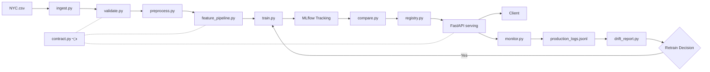
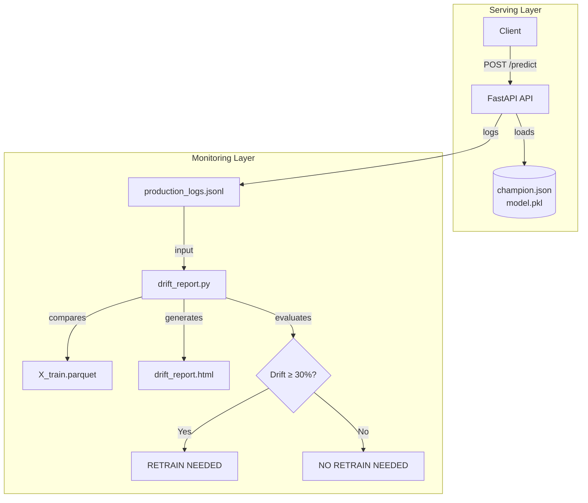

# 🚗 nyc-ride-eta-pipeline

An end-to-end ML pipeline for predicting trip durations in NYC, designed with production reliability and model maintenance as first-class citizens.

## 📌 Project Overview

This project implements a professional ML system to predict ride ETA, focusing on the full lifecycle: from robust data validation and engineered feature pipelines to deployment and automated monitoring. It addresses common production failures (like train-serving skew) using a shared data contract and implements a drift-based retraining trigger policy to ensure model longevity in non-stationary environments.

## 🏗️ System Architecture



### Data Flow

Raw Data $\rightarrow$ `ingest.py` $\rightarrow$ `validate.py` $\rightarrow$ `preprocess.py` $\rightarrow$ `feature_pipeline.py` $\rightarrow$ `train.py` $\rightarrow$ MLflow $\rightarrow$ `compare.py` $\rightarrow$ `registry.py` $\rightarrow$ FastAPI

`src/contract.py` is the **single source of truth** shared by `validate.py`, `feature_pipeline.py`, and `serving/schemas.py`. All bounds and feature lists flow from one file to prevent train-serving skew.

## 📁 Project Structure

```text
nyc-ride-eta-pipeline/
├── data/
│   ├── raw/                # Raw datasets (ignored by Git)
│   ├── processed/          # DVC-tracked processed features
│   └── monitoring/          # Prediction logs & retrain history
├── docker/                 # Dockerfiles & Docker Compose
├── models/
│   ├── serving/            # Champion model artifacts (.pkl)
│   └── champion.json       # Champion metadata & metrics
├── reports/
│   └── drift/              # Generated Evidently HTML reports
├── src/
│   ├── contract.py         # Shared API/Data contract (bounds, features)
│   ├── reproducibility.py   # Global seed management
│   ├── data/               # Ingestion & preprocessing
│   │   ├── ingest.py
│   │   ├── preprocess.py
│   │   └── validate.py
│   ├── features/           # Engineering pipelines
│   │   ├── feature_config.py
│   │   └── feature_pipeline.py
│   ├── models/             # Training & registry
│   │   ├── train.py
│   │   ├── compare.py
│   │   ├── optuna_tuner.py
│   │   └── registry.py
│   ├── monitoring/         # Drift detection & decision
│   │   ├── monitor.py
│   │   └── drift_report.py
│   ├── scripts/            # Simulation tools
│   │   ├── demo_cli.py
│   │   └── traffic_simulator.py
│   └── serving/           # FastAPI app & schemas
│       ├── api.py
│       ├── model_loader.py
│       └── schemas.py
├── tests/                  # API & unit test suite
│   └── test_api.py
└── README.md               # Setup & operational guide
```

## Tech Stack

- **Language:** Python 3.11
- **Data Engineering:** Pandas, PyArrow (Parquet)
- **ML Pipeline:** Scikit-Learn
- **Experiment Tracking:** MLflow
- **Data Contract:** `src/contract.py` (shared bounds/feature lists across validation, training, serving)
- **Models:** XGBoost, LightGBM, CatBoost
- **Serving:** FastAPI, Uvicorn, Docker
- **Monitoring:** Evidently AI (drift detection), JSONL-based prediction logging
- **Testing:** pytest (15 tests: valid requests + input validation)
- **Data Versioning:** DVC

## 🚀 Getting Started

### 1. Setup Environment

```bash
python -m venv .venv
.\venv\Scripts\activate
pip install -r requirements.txt
dvc init
```

### 2. Validate Raw Data

Validate the raw dataset for nulls, coordinate bounds, impossible speeds, and duration outliers.
Validation bounds come from the shared data contract (`src/contract.py`).
This step produces `data/validation_report.json` with a breakdown of all failure categories.

```bash
python -m src.data.validate
```

**Validation checks performed:**

| Check | Rule |
| --- | --- |
| **Nulls** | Critical fields must be present (datetime, coords, duration) |
| **Coordinate Bounds** | Lat/Lon within NYC bounds (from `contract.py`) |
| **Passenger Count** | Between 1 and 6 |
| **Trip Duration** | Between 60s and 4h |
| **Zero Distance** | Pickup and dropoff must differ |
| **Impossible Speed** | Haversine-derived speed ≤ 150 km/h |
| **Quality Gate** | Hard fail if > 10% of records are dropped |

*Note: validation is also automatically invoked inside `src/data/preprocess.py` before feature engineering.*

### 3. Run Data Pipeline (with DVC Slicing)

The preprocessing script accepts an optional `--end-month` argument to simulate staged data ingestion (e.g., data arriving month-by-month).

**Full Dataset (Default):**

```bash
python -m src.data.preprocess
```

**Time-based Slicing:**

```bash
# Slice v1: Jan 2016 only
python -m src.data.preprocess --end-month 1

# Slice v2: Jan–Mar 2016
python -m src.data.preprocess --end-month 3
```

### 4. Version Data & Models (DVC)

After running the pipeline, snapshot the processed artifacts into DVC, then commit the pointer files to Git:

```bash
dvc add data/processed/X_train.parquet data/processed/y_train.parquet models/feature_pipeline.pkl
git add data/processed/*.dvc models/*.dvc data/contracts/feature_registry.json
git commit -m "feat(dvc): versioned dataset slice"
```

### 5. Train Models

Train the baseline and all advanced models on the currently active dataset.
*Note: The training script uses a strictly chronological 80/20 split to prevent future data leakage (M2 rule). MLflow logs are stored in a lightweight SQLite database (`mlflow.db`), which is ignored by Git.*

### Hyperparameter tuning (LightGBM + XGBoost only)

Uses [Optuna](https://optuna.org/) with a minimal parameter space (20 trials per model). Only LightGBM and XGBoost are tuned; Ridge and CatBoost use default hyperparameters. Running with `--tune` trains the tuned models using Optuna-discovered best params, logged the same way as the default flow — with `tune_trials` and `tune_framework` params to distinguish them in MLflow.

```bash
python -m src.models.train --model all --tune --tune-trials 20
```

| Parameter | LightGBM Range | XGBoost Range |
| --- | --- | --- |
| `n_estimators` | 100–500 | 100–500 |
| `max_depth` | 3–8 | 3–8 |
| `learning_rate` | 0.01–0.2 (log) | 0.01–0.2 (log) |

**Train all models (Ridge, XGBoost, LightGBM, CatBoost):**

```bash
python -m src.models.train --model all
```

**Train a single model:**

```bash
python -m src.models.train --model ridge
python -m src.models.train --model xgboost
```

### 6. Compare Models & Select Champion

Compare all trained MLflow runs and promote the best model:

```bash
# Rank all runs by MAE (lower is better)
python -m src.models.compare --metric mae

# Rank by R2 (higher is better — use --no-ascending or omit --ascending)
python -m src.models.compare --metric r2 --ascending

# Promote the best run as the champion model
python -m src.models.registry
```

The promotion step now exports both serving artifacts used in deployment:

- `models/champion.json` (champion metadata)
- `models/serving/model.pkl` (single champion model artifact used by the API image)

If you want model promotion to be reproducible across machines, version the
promoted serving model with DVC and commit the pointer:

```bash
dvc add models/serving/model.pkl
git add models/serving/model.pkl.dvc models/champion.json
git commit -m "feat(model): promote champion serving artifact"
```

Verify the serving artifact exists before container builds:

```bash
ls models/serving/model.pkl
```

**Performance Summary (Full Dataset):**

| Model | MAE | RMSE | R² |
| ----- | --: | --: | --: |
| Ridge (Baseline) | 292.80s | 443.03s | 0.6148 |
| XGBoost | 245.11s | 384.67s | 0.7096 |
| LightGBM | 244.92s | 384.42s | 0.7100 |
| CatBoost | 246.17s | 386.22s | 0.7073 |
| **Champion**(LightGBM) | 244.92s | 384.42s | 0.7100 |

*Boosting models outperform Ridge baseline by ~16% on MAE. LightGBM and XGBoost are nearly tied; LightGBM edges ahead by 0.19s.*

**Why LightGBM as the champion?**

This problem requires capturing **non-linear relationships and feature interactions** (e.g., cyclical time effects × pickup location × passenger count). A linear baseline (Ridge) can only model additive effects and achieves R² = 0.61 — confirming strong non-linearity in the data. Gradient boosting trees are the natural choice for this structure:

- **Feature Interactions**: Gradient boosting models automatically learn hierarchical interactions without manual feature engineering at the interaction level. Cyclical encodings (hour_sin/cos), haversine distance, and vendor flags compound meaningfully only in a non-linear model.
- **Robustness to Scale**: All features pass through the same preprocessing pipeline, but tree models are invariant to monotonic transformations — they don't require aggressive scaling or distribution normalization.
- **LightGBM vs. XGBoost vs. CatBoost**: All three boosting frameworks achieve nearly identical MAE (within ~1.3s). LightGBM was selected because:
  - *Leaf-wise tree growth* produces deeper splits with fewer leaves, capturing complex patterns more efficiently.
  - *Faster training and inference* via histogram-based binning and GOSS (Gradient-based One-Side Sampling).
  - *Lower memory footprint* — important for API serving where model load time matters.
- **Why not neural networks?** The tabular feature space (~30 engineered features) with no image/text modalities is a regime where gradient boosting consistently matches or exceeds deep learning, with significantly less hyperparameter tuning and training time. NNs also require extensive normalization and are harder to debug on tabular data.
- **Why train on the boosting models first before the baseline?** Ridge serves as a diagnostic baseline — if a linear model were close in performance, the engineered features would be mostly linearly separable. The 16% gap confirms that the feature engineering (cyclical time, spatial distance, hour-day interaction) is only fully expressive in a non-linear learner.
- **Why not an ensemble of the three boosters?** Stacking or averaging the three boosters would marginally improve MAE (~0.1–0.3%), but at the cost of serving complexity — triple model loading, inference latency, and monitoring overhead. The single LightGBM champion balances performance and operational simplicity.

### 7. View Experiment History

```bash
mlflow ui --backend-store-uri sqlite:///mlflow.db
```

*(Open <http://127.0.0.1:5000> in your browser)*

### 8. Start API

Start the FastAPI server (loads champion model at startup):

```bash
python -m uvicorn src.serving.api:app --reload
```

*(Open <http://127.0.0.1:8000/docs> for Swagger UI)*

**Endpoints:**

- `GET /health` — Health check
- `GET /model-info` — Champion model metadata (type, metrics, run ID)
- `POST /predict` — Single trip ETA prediction
- `POST /predict/batch` — Batch predictions (up to 100 trips)

**Example Prediction Request:**

```json
{
  "pickup_datetime": "2016-05-15T14:30:00Z",
  "passenger_count": 2,
  "pickup_latitude": 40.748817,
  "pickup_longitude": -73.985428,
  "dropoff_latitude": 40.742563,
  "dropoff_longitude": -73.98748,
  "vendor_id": 1,
  "store_and_fwd_flag": "N"
}
```

**Example Response:**

```json
{ "eta_seconds": 318.92 }
```

**CURL Examples:**

```bash
# Health check
curl http://127.0.0.1:8000/health

# Model metadata
curl http://127.0.0.1:8000/model-info

# Single prediction
curl -X POST http://127.0.0.1:8000/predict \
  -H "Content-Type: application/json" \
  -d '{
    "pickup_datetime": "2016-05-15T14:30:00Z",
    "passenger_count": 2,
    "pickup_latitude": 40.748817,
    "pickup_longitude": -73.985428,
    "dropoff_latitude": 40.742563,
    "dropoff_longitude": -73.98748,
    "vendor_id": 1,
    "store_and_fwd_flag": "N"
  }'

# Batch prediction (multiple trips in one request)
curl -X POST http://127.0.0.1:8000/predict/batch \
  -H "Content-Type: application/json" \
  -d '{
    "trips": [
      {
        "pickup_datetime": "2016-05-15T14:30:00Z",
        "passenger_count": 2,
        "pickup_latitude": 40.748817,
        "pickup_longitude": -73.985428,
        "dropoff_latitude": 40.742563,
        "dropoff_longitude": -73.98748,
        "vendor_id": 1,
        "store_and_fwd_flag": "N"
      },
      {
        "pickup_datetime": "2016-05-15T18:00:00Z",
        "passenger_count": 4,
        "pickup_latitude": 40.7128,
        "pickup_longitude": -74.0060,
        "dropoff_latitude": 40.7580,
        "dropoff_longitude": -73.9855,
        "vendor_id": 2,
        "store_and_fwd_flag": "N"
      }
    ]
  }'
```

### 9. Run the Demo Playbook

Test the API with curated valid + invalid requests:

```bash
python -m src.scripts.demo_cli
```

Sends a batch of realistic predictions (single + bulk) and edge cases
(out-of-range coordinates, missing fields, bad vendor IDs) to verify that
validation and Pydantic schemas are working as expected.

### 10. Run Tests (pytest)

Run the API test suite before packaging/deployment:

```bash
python -m pytest tests/test_api.py -q
```

For detailed test names/output:

```bash
python -m pytest tests/test_api.py -v
```

### 11. Run with Docker

Build and start the API container (only champion model baked in at build time):

```bash
# Prerequisite: export current champion serving artifact
python -m src.models.registry
```

Run pre-build validation checks (WSL/Linux):

```bash
bash docker/docker_preflight.sh
```

Optional deep check (builds API image and validates native ML imports inside container):

```bash
bash docker/docker_preflight.sh --smoke
```

```bash
docker build -f docker/Dockerfile.api -t eta-api .
docker run -p 8000:8000 eta-api
```

Or run with Docker Compose (API + MLflow UI, each with its own Dockerfile):

```bash
# From project root
docker compose -f docker/docker-compose.yml build
docker compose -f docker/docker-compose.yml up -d
```

- **API:** <http://127.0.0.1:8000/docs> (Swagger UI)
- **MLflow UI:** <http://127.0.0.1:5000>

### 12. Traffic Simulation

Start the FastAPI server first, then generate production traffic to fill monitoring logs or simulate drift:

```bash
# Start the API server (in a separate terminal)
python -m uvicorn src.serving.api:app --reload

# Simulate baseline traffic (historical sampled rows)
python -m src.scripts.traffic_simulator --count 1000 --scenario normal

# Simulate drifted traffic patterns
python -m src.scripts.traffic_simulator --count 100 --scenario suburban
python -m src.scripts.traffic_simulator --count 100 --scenario rush
python -m src.scripts.traffic_simulator --count 100 --scenario holiday
```

| Scenario | Description |
| --- | --- |
| `normal` | Baseline (historical rows sampled from training data) |
| `suburban` | Outer boroughs, longer trip distances, fewer riders |
| `rush` | Extended peak-hour (6–11 AM, 4–9 PM), longer distances |
| `holiday` | Weekend-heavy, short local trips, single passengers |

All scenarios default to seed `42`. Use `--seed` to override.

### 13. Monitoring & Drift Detection

Every prediction made through `/predict` or `/predict/batch` is automatically logged to `data/monitoring/production_logs.jsonl`. Use these logs to detect feature drift and trigger retraining decisions.

**Generate a drift report (HTML) + retraining decision:**

```bash
python -m src.monitoring.drift_report
```

This command does two things:

1. Saves `reports/drift/drift_report.html` (Evidently AI visualization)
2. Prints a CLI decision summary (drift severity vs. retrain threshold)

Note: production logs are prediction-time records (features + prediction). They do not include the final trip outcome at prediction time.

**Why this drift detection approach?**

Model drift in production manifests in two ways:

| Drift Type | Detection Method | Feasibility in This Pipeline |
| --- | --- | --- |
| **Feature (Input) Drift** | Compare live feature distributions against training data | ✅ **Implemented** — available at prediction time |
| **Concept (Performance) Drift** | Compare live MAE against baseline MAE | ❌ Out of scope — ground-truth durations arrive hours after prediction |

We track **feature distribution drift** because it's the only signal available at prediction time. If the distribution of incoming trips (time of day, location, passenger count) shifts away from what the model was trained on, prediction quality will degrade — even if we can't measure MAE yet.

**Why Evidently AI?**

- **Statistically grounded**: Uses Kolmogorov-Smirnov tests per feature for distribution shift detection — not heuristic thresholding.
- **Tree-model aware**: Our champion (LightGBM) relies on feature distributions for split decisions. Distribution shifts directly affect split effectiveness.
- **Feature-space alignment**: We transform production logs through the same pipeline (`feature_pipeline.py`) before comparison, so the drift analysis compares the exact features the model consumes — not raw input fields.
- **Visualization**: Generates an interactive HTML report with per-feature drift scores, making it easy to identify which features are shifting (temporal, spatial, or behavioral).

**What drift patterns do we expect in this domain?**

NYC taxi demand is inherently non-stationary:

- **Temporal drift**: Holiday events, weather disruptions, or construction can shift hourly/daily pickup patterns.
- **Spatial drift**: Surge pricing zones or new transit lines can change origin/destination distributions.
- **Behavioral drift**: Ride-hailing adoption or corporate travel policies can change passenger count distributions.

Our `traffic_simulator.py` can generate controlled drift scenarios (`suburban`, `rush`, `holiday`) that simulate these shifts and validate the detection pipeline.

**Why 30% drift threshold?**

The threshold is set at 30% of features showing distribution shift (`DRIFT_SEVERITY_THRESHOLD = 0.30`). This balances:

- **Sensitivity**: A single drifting feature (~3%) shouldn't trigger a retrain — normal daily variance is expected.
- **False positive avoidance**: 30% implies a meaningful distribution shift across multiple dimensions (temporal + spatial + behavioral), not just noise in one feature.
- **Operational cost**: Retraining is expensive (data pipeline + model training + promotion). The threshold ensures retraining is only recommended when the shift is substantial enough to likely degrade predictions.

A higher threshold (e.g., 50%) risks missing subtle but impactful shifts. A lower threshold (e.g., 10%) risks retraining churn from normal daily fluctuations.

**Monitoring Architecture:**



## 🔄 Retraining Strategy

This project implements a **drift detection and retraining recommendation** pipeline — it does **not** execute retraining automatically. The monitoring module analyzes production logs, detects feature distribution shifts using Evidently AI, and emits a clear decision signal:

| Signal | Condition | Threshold |
| --- | --- | --- |
| **Drift Detected** | ≥ 30% of model features show distribution shift vs. training data | `DRIFT_SEVERITY_THRESHOLD = 0.30` |
| **No Drift** | Drift share is below threshold | `< 30%` |

**How it works:**

1. Every prediction logged to `production_logs.jsonl` captures the raw input features used by the model.
2. `src/monitoring/drift_report.py` loads recent production logs, transforms them through the same feature pipeline, and compares the distributions against `X_train.parquet` using Evidently AI's `DataDriftPreset`.
3. The drift score (share of drifted features) is compared against a 30% threshold.
4. A decision is printed: **RETRAINING NEEDED** or **NO RETRAINING NEEDED**.

**What happens after a trigger:**

When drift is detected, the CLI surfaces a recommendation. Actual retraining, model promotion, and deployment are handled as a separate manual or CI/CD pipeline workflow (outside the scope of this project).

**Design constraints:**

- **No automatic retraining**: The pipeline is intentionally designed as a monitoring and alerting system. Training execution is a separate approved workflow.
- **MAE is a delayed signal**: Ground-truth trip durations are not available at prediction time. Online MAE gating is intentionally excluded from the drift detection path. Offline MAE evaluation (from labeled outcomes) can serve as an additional trigger once labels become available.
- **Single decision dimension**: The current implementation relies solely on feature distribution drift. Real-world systems would layer performance decay, label-based quality gates, and cooldown windows on top of this signal.

## 👥 Team

- **Nidhi Sharma**
- **Kapil Chhabra**
- **Ronak Shah**

## 📚 References & Acknowledgments

**Dataset:**

- NYC Taxi Trip Duration dataset by Yasser H. Available at [https://www.kaggle.com/datasets/yasserh/nyc-taxi-trip-duration](https://www.kaggle.com/datasets/yasserh/nyc-taxi-trip-duration)

**Key Libraries:**

| Library | Purpose |
| --- | --- |
| [scikit-learn](https://scikit-learn.org/) (v1.9.0) | Ridge baseline model, preprocessing utilities, model evaluation metrics |
| [XGBoost](https://xgboost.ai/) (v3.2.0) | Gradient boosting model candidate |
| [LightGBM](https://lightgbm.readthedocs.io/) (v4.7.0) | Gradient boosting champion model |
| [CatBoost](https://catboost.ai/) (v1.2.10) | Gradient boosting model candidate |
| [pandas](https://pandas.pydata.org/) (v2.3.3) + [pyarrow](https://arrow.apache.org/) (v25.0.0) | Data manipulation and Parquet I/O |
| [FastAPI](https://fastapi.tiangolo.com/) (v0.141.1) + [Pydantic](https://docs.pydantic.dev/) (v2.13.4) | REST API serving and request validation |
| [MLflow](https://mlflow.org/) (v3.15.1) | Experiment tracking, parameter logging, and metric comparison |
| [DVC](https://dvc.org/) (v3.67.1) | Data and model versioning |
| [Evidently AI](https://docs.evidentlyai.com/) (v0.7.21) | Feature distribution drift detection and reporting |
| [Optuna](https://optuna.org/) (v4.9.0) | Hyperparameter optimization |
| [pytest](https://docs.pytest.org/) (v9.1.1) + [httpx](https://www.python-httpx.org/) (v0.28.1) | API integration testing |

**Course:** ML Engineering, Birla Institute of Technology and Science (BITS) Pilani
