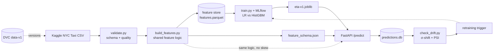

# NYC Ride ETA Prediction — End-to-End ML Pipeline

**Course:** Machine Learning Engineering (PCAM ZC412) · EC-1 Mini-Project
**Problem:** Delivery / Ride ETA Prediction (tabular)

Predicts NYC taxi trip duration (ride ETA) from trip distance, time-of-day, location, and
passenger details. The project implements the full production ML lifecycle: reliable data
ingestion and validation, versioned data, tracked experiments, a containerized REST API, and
post-deployment monitoring with drift detection and a retraining strategy.

## Results
| Model | RMSLE ↓ | MAE (s) | R² |
|-------|:-------:|:-------:|:--:|
| Linear Regression (baseline) | 0.5432 | 355 | 0.46 |
| **HistGradientBoosting (production, `eta-v1`)** | **0.3967** | **219** | **0.71** |

Trained on 1,450,674 cleaned trips (99.45% of raw retained) with 9 engineered features.
Experiment details and model-selection rationale: [`docs/model_comparison.md`](docs/model_comparison.md).

## Architecture



DVC versions the data, Git versions the code, MLflow versions the experiments, Docker packages the service.

## Tech stack
- **Language:** Python 3.10+
- **Data & features:** pandas, NumPy, PyArrow (Parquet)
- **Modeling:** scikit-learn (HistGradientBoosting); XGBoost / LightGBM / CatBoost available
- **Experiment tracking:** MLflow
- **Data versioning:** DVC
- **Serving:** FastAPI, Uvicorn, Pydantic, Docker
- **Monitoring:** SQLite prediction log, PSI + σ-shift drift detection
- **Testing:** pytest

## Repository layout
```
nyc-ride-eta-pipeline/
├── config/config.yaml            # paths, params, thresholds
├── data/
│   ├── raw/                      # source CSV (DVC-tracked, git-ignored)
│   ├── processed/                # cleaned parquet + feature store (git-ignored)
│   ├── download_data.py          # dataset download helper
│   └── validate.py               # schema + data-quality checks -> cleaned parquet
├── features/build_features.py    # shared feature logic (train == serve)
├── training/train.py             # MLflow-tracked training + model comparison
├── serving/
│   ├── api.py                    # FastAPI service (/health, /predict)
│   ├── schemas.py                # Pydantic request/response contracts
│   └── sample_requests.py        # sample API calls (valid + invalid)
├── monitoring/
│   ├── logger.py                 # log every prediction to SQLite
│   ├── simulate_drift.py         # generate a traffic shift
│   └── check_drift.py            # σ-shift + PSI drift detection
├── models/                       # eta-v1.joblib (git-ignored) + feature_schema.json
├── tests/test_features.py        # pytest unit tests
├── docs/                         # architecture, model comparison, retraining design
├── Dockerfile / .dockerignore / requirements-serve.txt
├── requirements.txt / conftest.py / .gitignore
└── README.md
```

## Usage
```bash
# environment
python -m venv venv && venv\Scripts\activate        # source venv/bin/activate on macOS/Linux
pip install -r requirements.txt

# data -> validate -> features
python data/validate.py                 # -> data/processed/train_clean.parquet
python features/build_features.py       # -> features.parquet + models/feature_schema.json

# train + compare (MLflow)
python training/train.py                # saves models/eta-v1.joblib
mlflow ui --backend-store-uri sqlite:///mlflow.db     # http://127.0.0.1:5000

# serve the model
uvicorn serving.api:app --reload --port 8000          # interactive docs at /docs
python serving/sample_requests.py                     # sample valid + invalid calls
# or run the container:
docker build -t nyc-eta-api . && docker run --rm -p 8000:8000 nyc-eta-api

# monitoring + drift
python monitoring/simulate_drift.py     # generate a traffic shift (API must be running)
python monitoring/check_drift.py        # -> drift report (monitoring/drift_report.txt)

# tests
pytest -q
```

### Example request
```bash
curl -X POST http://127.0.0.1:8000/predict -H "Content-Type: application/json" -d '{
  "pickup_datetime": "2016-03-14T17:24:00",
  "pickup_latitude": 40.7484, "pickup_longitude": -73.9857,
  "dropoff_latitude": 40.7580, "dropoff_longitude": -73.9850,
  "passenger_count": 1
}'
# -> {"eta_seconds": 405.9, "eta_minutes": 6.8, "model_version": "eta-v1"}
```

## Documentation
- [`docs/architecture.md`](docs/architecture.md) — components and data/versioning contracts
- [`docs/model_comparison.md`](docs/model_comparison.md) — experiments and model selection
- [`docs/retraining_design.md`](docs/retraining_design.md) — drift monitoring and retraining strategy

## Team
| Name | Role |
|------|------|
| Nidhi Sharma | ML Engineering |
| Kapil Chhabra | ML Engineering |
| Ronak Shah | ML Engineering |

## References
- Machine Learning Production Systems, Robert Crowe et al., O'Reilly, 2024.
- Machine Learning Engineering, Andriy Burkov, 2020.
- Machine Learning Engineering with Python (2e), A. P. McMahon, Packt, 2023.
- Dataset: [NYC Taxi Trip Duration — Kaggle](https://www.kaggle.com/competitions/nyc-taxi-trip-duration).
