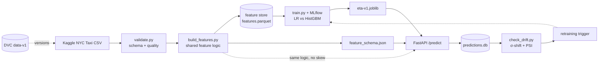

# NYC Ride ETA Prediction — End-to-End ML Pipeline

**Course:** Machine Learning Engineering (PCAM ZC412) · Mini-Project (EC-1, 40%)
**Flavor A:** Delivery / Ride ETA Prediction (Tabular · Modules M2 → M3 → M4 → M5)
**Repo:** https://github.com/sharma-nidhi/nyc-ride-eta-pipeline

A production-style ML system that predicts NYC taxi trip duration (ride ETA) from trip distance,
time-of-day, location, and passenger details — covering the full lifecycle: reliable data
ingestion + validation, versioned data, tracked experiments, a containerized REST API, and
monitoring with drift detection and a retraining strategy.

## Results
| Model | RMSLE ↓ | MAE (s) | R² |
|-------|:-------:|:-------:|:--:|
| Linear Regression (baseline) | 0.5432 | 355 | 0.46 |
| **HistGradientBoosting (best, `eta-v1`)** | **0.3967** | **219** | **0.71** |

Trained on 1,450,674 cleaned trips (99.45% of raw retained) with 9 engineered features.
Full write-up: [`docs/model_comparison.md`](docs/model_comparison.md).

## Architecture



DVC versions the data, Git versions the code, MLflow versions the experiments, Docker packages the service.

## Repository layout
```
nyc-ride-eta-pipeline/
├── config/config.yaml            # paths, params, thresholds
├── data/
│   ├── raw/                      # Kaggle CSV (DVC-tracked, git-ignored)
│   ├── processed/                # cleaned parquet + feature store (git-ignored)
│   ├── download_data.py          # optional Kaggle API download
│   └── validate.py               # schema + data-quality checks -> cleaned parquet
├── features/build_features.py    # SHARED feature logic (train == serve)
├── training/train.py             # MLflow-tracked training + model comparison
├── serving/
│   ├── api.py                    # FastAPI service (/health, /predict)
│   ├── schemas.py                # Pydantic request/response contracts
│   └── sample_requests.py        # sample API calls (valid + invalid)
├── monitoring/
│   ├── logger.py                 # log every prediction to SQLite
│   ├── simulate_drift.py         # generate a traffic shift
│   └── check_drift.py            # σ-shift + PSI drift detection
├── models/                       # eta-v1.joblib (git-ignored) + feature_schema.json
├── tests/test_features.py        # pytest unit tests
├── docs/                         # setup guides + design docs (see below)
├── Dockerfile / .dockerignore / requirements-serve.txt
├── requirements.txt / conftest.py / .gitignore
└── README.md
```

## Quickstart
Full setup (env, Git, Kaggle, DVC): [`docs/SETUP.md`](docs/SETUP.md). Beginner walkthroughs are in
`docs/` (VS Code, Git, DVC, Docker).

```bash
# 1. environment
python -m venv venv && venv\Scripts\activate        # (source venv/bin/activate on macOS/Linux)
pip install -r requirements.txt

# 2. data -> validate -> features  (M2)
python data/download_data.py            # or place train.csv in data/raw/ manually
python data/validate.py                 # -> data/processed/train_clean.parquet
python features/build_features.py       # -> features.parquet + models/feature_schema.json

# 3. train + compare  (M3)
python training/train.py                # logs to sqlite:///mlflow.db, saves models/eta-v1.joblib
mlflow ui --backend-store-uri sqlite:///mlflow.db     # http://127.0.0.1:5000

# 4. serve  (M4)
uvicorn serving.api:app --reload --port 8000          # docs at /docs
python serving/sample_requests.py                     # valid + invalid calls
# or containerized:
docker build -t nyc-eta-api . && docker run --rm -p 8000:8000 nyc-eta-api

# 5. monitor + drift  (M5)
python monitoring/simulate_drift.py     # generate a traffic shift (API must be running)
python monitoring/check_drift.py        # -> DRIFT DETECTED + monitoring/drift_report.txt

# tests
pytest -q
```

## Documentation
- [`docs/PLAN.md`](docs/PLAN.md) — 28-day plan of action
- [`docs/architecture.md`](docs/architecture.md) — components & contracts
- [`docs/model_comparison.md`](docs/model_comparison.md) — experiments + model choice (M3)
- [`docs/retraining_design.md`](docs/retraining_design.md) — drift triggers & retraining (M5)
- Setup guides: [`SETUP`](docs/SETUP.md) · [`VS Code`](docs/VSCODE_SETUP.md) · [`Git`](docs/GIT_SETUP.md) · [`DVC`](docs/DVC_SETUP.md) · [`Docker`](docs/DOCKER_SETUP.md)

## Weekly milestones
| Week | Module | Status |
|------|--------|--------|
| 1 | M2 — ingestion, validation, features, DVC `data-v1` | ✅ |
| 2 | M3 — MLflow experiments, best model + report | ✅ |
| 3 | M4 — FastAPI service, Docker, tested endpoints | ✅ |
| 4 | M5 — prediction logging, drift detection, retraining design | ✅ |

## Team
| Name | Role |
|------|------|
| Nidhi Sharma | ML Engineering (repo owner) |
| Kapil Chhabra | ML Engineering |
| Ronak Shah | ML Engineering |

## References
- T1: *Machine Learning Production Systems*, Robert Crowe et al., O'Reilly, 2024.
- T2: *Machine Learning Engineering*, Andriy Burkov, 2020.
- R1: *Machine Learning Engineering with Python* (2e), A. P. McMahon, Packt, 2023.
- Dataset: [NYC Taxi Trip Duration — Kaggle](https://www.kaggle.com/competitions/nyc-taxi-trip-duration).
