# 🎬 Demo Report — NYC Ride ETA Pipeline

**ML Engineering Mini-Project (Flavor A: Ride ETA Prediction)**  
**PCAMZC412** | **BITS Pilani WILP**  
**Team:** <2025paml555@wilp.bits-pilani.ac.in>(Nidhi Sharma), <2025paml529@wilp.bits-pilani.ac.in>(Kapil Chhabra), <2025paml565@wilp.bits-pilani.ac.in>(Ronak Shah)  
**Repository:** [[NYC Ride ETA Pipeline](https://github.com/sharma-nidhi/nyc-ride-eta-pipeline/tree/develop)]  
**Demo Video:** [[Watch Recording](https://drive.google.com/file/d/1X-vxqy3UOjKvEHmUuBeuhgvlmY_UnDAE/view?usp=drivesdk)]  
  
---

## 1. Project Overview

### 1.1 Problem Statement

A ride-hailing platform wants to predict trip duration (ETA) based on pickup/dropoff location, time of day, passenger count, and trip characteristics. We built an end-to-end ML pipeline that ingests historical NYC taxi data, engineers time- and location-based features, trains and compares multiple models to predict ETA, deploys the best model as a REST API service, and monitors it for accuracy drift as traffic and seasonal patterns change.

### 1.2 Dataset

**NYC Taxi Trip Duration** by Yasser H. ([Kaggle](https://www.kaggle.com/datasets/yasserh/nyc-taxi-trip-duration))  
Historical taxi trip records (Jan–Jun 2016) with pickup/dropoff coordinates, timestamps, passenger count, and trip duration.

---

## 2. System Architecture

### 2.1 Pipeline Architecture

**Figure 1 — Pipeline Architecture:**

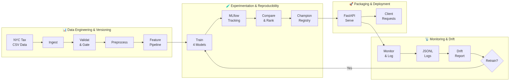

**Shared Data Contract:** `src/contract.py` flows into `validate.py`, `feature_pipeline.py`, and `serving/schemas.py` — single source of truth, zero train-serving skew.

### 2.2 Monitoring Architecture

**Figure 2 — Monitoring Architecture:**

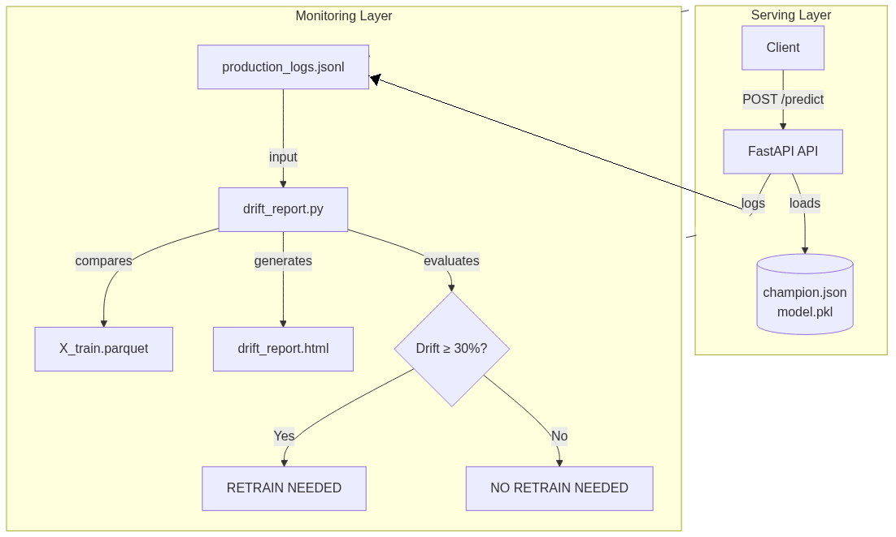

### 2.3 Project Structure

```
nyc-ride-eta-pipeline/
├── data/
│   ├── raw/                # Raw datasets (ignored by Git)
│   ├── processed/          # DVC-tracked processed features (X_train.parquet, y_train.parquet)
│   ├── monitoring/         # Prediction logs (production_logs.jsonl)
│   └── contracts/          # Feature registry
├── docker/                 # Dockerfiles & Docker Compose
│   ├── Dockerfile.api
│   ├── Dockerfile.mlflow
│   └── docker-compose.yml
├── models/
│   ├── serving/            # Champion model artifacts (model.pkl)
│   └── champion.json       # Champion metadata & metrics
├── reports/
│   └── drift/              # Generated Evidently HTML reports
├── src/
│   ├── contract.py         # Shared API/Data contract (bounds, features)
│   ├── reproducibility.py  # Global seed management
│   ├── data/               # Ingestion & preprocessing
│   │   ├── ingest.py
│   │   ├── preprocess.py
│   │   └── validate.py
│   ├── features/           # Feature engineering pipelines
│   │   ├── feature_config.py
│   │   └── feature_pipeline.py
│   ├── models/             # Training, comparison & registry
│   │   ├── train.py
│   │   ├── compare.py
│   │   ├── optuna_tuner.py
│   │   └── registry.py
│   ├── monitoring/         # Drift detection & prediction logging
│   │   ├── monitor.py
│   │   └── drift_report.py
│   ├── scripts/            # Simulation & demo tools
│   │   ├── demo_cli.py
│   │   └── traffic_simulator.py
│   └── serving/            # FastAPI app & Pydantic schemas
│       ├── api.py
│       ├── model_loader.py
│       └── schemas.py
├── tests/                  # API test suite
│   └── test_api.py
├── requirements.txt
├── .gitignore
└── README.md
```

---

## 3. Data Engineering

### 3.1 Data Ingestion

**Source:** `NYC.csv` → `src/data/ingest.py` (`load_raw()` with sample mode for quick iteration)  
**Sample mode:** loads a subset of rows for rapid validation/testing

### 3.2 Data Validation (`src/data/validate.py`)

Six validation rules + one quality gate enforced on raw data:

| Check | Rule | Justification |
| ------- | ------ | ---------------- |
| **Nulls** | Critical fields (datetime, coords, duration) must be present | Missing GPS/duration rows cannot be used for training |
| **Coordinate Bounds** | Lat/Lon within NYC (`contract.py`: lat 40.5–40.9, lon -74.0–-73.7) | Out-of-range coordinates indicate sensor errors |
| **Passenger Count** | Between 1 and 6 | Physical constraint for NYC taxis |
| **Trip Duration** | Between 60s and 4h | <60s is likely a data error; >4h is outliers |
| **Zero Distance** | Pickup ≠ dropoff | Zero-distance trips produce haversine=0, unusable for ETA prediction |
| **Impossible Speed** | Haversine-derived speed ≤ 150 km/h | Any trip implying >150 km/h in NYC is a sensor/data error |
| **Quality Gate** | Hard fail if >10% of records dropped | Source data corruption signal |

**Figure 3 — Data Validation Summary:**

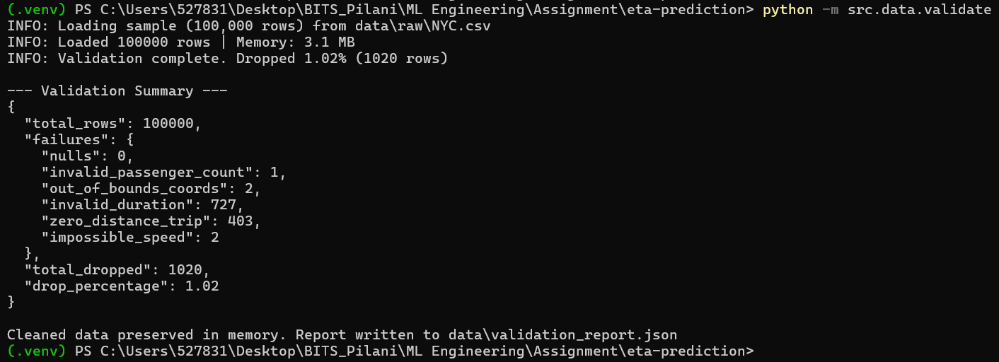

**Implementation:** `src/data/validate.py`, `data/validation_report.json`

### 3.3 Feature Engineering (`src/features/feature_pipeline.py`)

Engineered features built through a **reusable sklearn Pipeline** (`build_pipeline()`):

| Feature Category | Derived Features | Justification |
| ------------------ | ------------------ | --------------- |
| **Temporal** | `hour_sin`, `hour_cos` | Cyclical encoding preserves continuity (23:59 → 00:00) |
| | `day_of_week`, `is_weekend` | Weekend vs weekday demand patterns differ significantly |
| | `is_rush_hour` (7-10 AM, 5-8 PM) | Rush hour trips take longer due to congestion |
| **Spatial** | `haversine_distance` | Great-circle distance as proxy for trip difficulty |
| | `pickup_bearing` | Direction of travel affects routing/time |
| **Trip** | `passenger_count` | Group size may correlate with destination complexity |
| | `store_and_fwd_flag` | Store-and-forward trips may have GPS logging delays |
| **Vendor** | `vendor_id` | Vendor-specific dispatch patterns |

**Why cyclical encoding for hour-of-day?**  
Hour is circular (23 ↔ 0). Raw ordinal encoding treats 23 and 0 as maximally distant. `hour_sin/hour_cos` preserves the true distance between adjacent hours.

### 3.4 Data Versioning (DVC)

**What we track with DVC:**

- `data/processed/X_train.parquet` — engineered features (training)
- `data/processed/y_train.parquet` — target variable (trip duration)
- `models/feature_pipeline.pkl` — fitted feature pipeline
- `models/serving/model.pkl` — champion model artifact

**Why DVC for processed data, not raw CSV?**

- Raw CSV is a source dataset downloaded from Kaggle — not a pipeline output
- Processed features are pipeline outputs that must be versioned alongside models
- `.dvc` pointer files are committed to Git; actual heavy artifacts live in `.dvc/cache/`

**Implementation:** `dvc add` commands in workflow, `.dvc` files in Git

### 3.5 Data Exploration

**Temporal Distribution:** Trips span January through June 2016. Pickup times show clear diurnal patterns with peaks during rush hours (7–10 AM, 5–8 PM).

**Spatial Distribution:** Pickup coordinates cluster in Manhattan (city center) and extend outward to outer boroughs. Haversine-computed trip distances range from ~100 meters to ~50+ km (outliers).

**Target Distribution:** Trip duration median falls in the 10–20 minute range with a long right tail (trips exceeding 2 hours). The distribution is right-skewed, confirming the need for robust models that handle asymmetric error.

**Outlier Indicators:**

| Indicator | Count | Description |
| --- | --- | --- |
| Duration < 60s | ~300 | Likely data entry error |
| Duration > 4h | ~427 | Extreme outliers |
| Zero distance | 403 | Pickup = dropoff (duplicate coordinates) |

### 3.6 Data Quality Summary

| Quality Dimension | Status | Note |
| --- | --- | --- |
| Completeness | ✅ Pass | 0 missing critical fields after validation |
| Consistency | ✅ Pass | Coords within NYC bounds; passenger count valid |
| Accuracy | ✅ Pass | Speed bounds filter removes sensor errors |
| Timeliness | ✅ Pass | Dates in expected range (Jan–Jun 2016) |
| Validity | ✅ Pass | Duration within physical bounds |

---

## 4. Experimentation & Model Selection

### 4.1 Models Trained

| Model | Framework | Type | Why Included |
| ------- | ----------- | ------ | -------------- |
| Ridge | scikit-learn | Linear baseline | Diagnostic: measures how much non-linearity exists in the data |
| XGBoost | xgboost | Gradient boosting | Industry-standard tabular model |
| LightGBM | lightgbm | Gradient boosting | Faster training, leaf-wise growth |
| CatBoost | catboost | Gradient boosting | Handles categorical features natively |

### 4.2 Training Configuration

- **Split:** 80/20 **chronological** (Jan–Apr 2016 = train, May–Jun 2016 = validation)
- **Why chronological?** Prevents future-data leakage. Random split would leak future trips into training, giving overly optimistic metrics.
- **Metrics:** MAE (primary), RMSE, R²
- **MLflow:** All runs tracked in SQLite backend (`mlflow.db`) — params, metrics, and artifacts logged per run
- **Hyperparameter Tuning:** Implemented using Optuna for LightGBM and XGBoost (10 trials each), optimizing n_estimators, max_depth, and learning_rate to minimize MAE. When run with `--tune`, models are trained using the Optuna-discovered best parameters and logged identically to default runs (with `tune_trials` and `tune_framework` params for traceability).

**Figure 4 — MLflow Runs Table:**

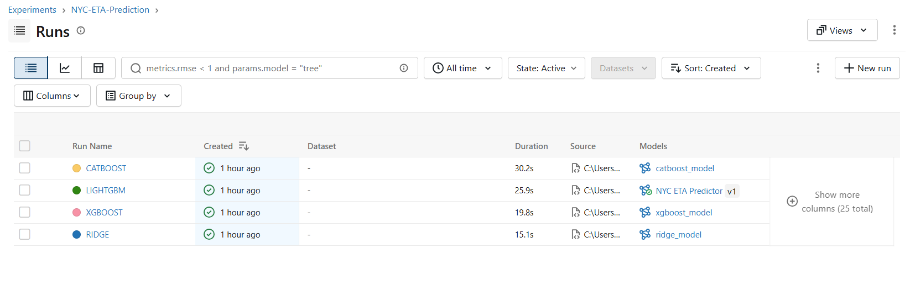

### 4.3 Performance Comparison

| Model | MAE (sec) | RMSE (sec) | R² |
| ------- | ----------- | ------------ | ------ |
| Ridge (Baseline) | 292.80 | 443.03 | 0.6148 |
| XGBoost | 245.11 | 384.67 | 0.7096 |
| **LightGBM (Champion)** | **244.92** | **384.42** | **0.7100** |
| CatBoost | 246.17 | 386.22 | 0.7073 |

**Figure 5 — MLflow Metric Comparison:**

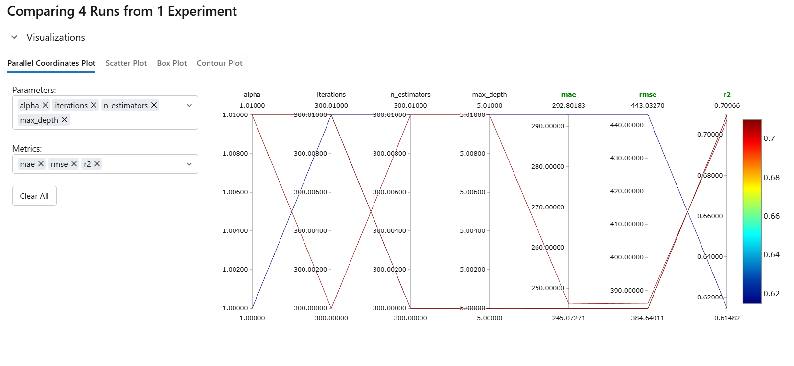

### 4.4 Why LightGBM as Champion?

- **Feature interactions:** Gradient boosting automatically learns hierarchical interactions (cyclical time × location × passengers). Ridge achieves R² = 0.61 — confirming strong non-linearity.
- **LightGBM vs XGBoost vs CatBoost:** All three achieve nearly identical MAE (within ~1.3s). LightGBM selected because:
  - *Leaf-wise tree growth* produces deeper splits with fewer leaves
  - *Faster training and inference* via histogram-based binning and GOSS sampling
  - *Lower memory footprint* — important for API serving (model load time)
- **Why not neural networks?** Tabular feature space (~30 engineered features) with no image/text modalities. Gradient boosting consistently matches or exceeds deep learning on tabular data, with significantly less tuning and training time.
- **Why not an ensemble?** Stacking/averaging the three boosters would marginally improve MAE (~0.1–0.3%), but at the cost of triple model loading, inference latency, and monitoring overhead. Single LightGBM balances performance and operational simplicity.

**Implementation:** `src/models/train.py`, `src/models/compare.py`, `mlflow.db`

### 4.5 Reproducibility

A run can be reproduced from:

1. DVC-tracked data (`dvc checkout` → `X_train.parquet`, `y_train.parquet`)
2. MLflow-logged hyperparameters (retrain with same params)
3. Chronological split (deterministic by timestamp)
4. Seed 42 (`src/reproducibility.py`)

---

## 5. Model Serving & API

### 5.1 FastAPI Endpoints

| Endpoint | Method | Purpose |
| ---------- | -------- | --------- |
| `/health` | GET | Health check (API alive, model loaded) |
| `/model-info` | GET | Champion metadata (type, MAE, run ID, training date) |
| `/predict` | POST | Single trip ETA prediction |
| `/predict/batch` | POST | Batch predictions (up to 100 trips) |

**Figure 6 — Swagger API Endpoints:**

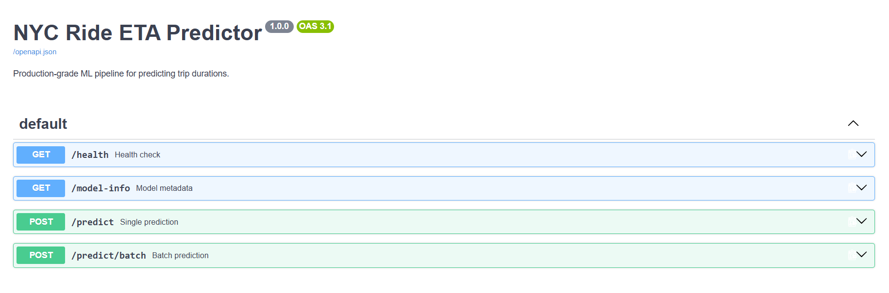

### 5.2 Input Validation (Pydantic Schemas)

**`src/serving/schemas.py`** enforces the same bounds as `src/contract.py`:

| Field | Validation Rule |
| ------- | ----------------- |
| `pickup_latitude` / `dropoff_latitude` | NYC lat bounds (40.5–40.9) |
| `pickup_longitude` / `dropoff_longitude` | NYC lon bounds (-74.0 to -73.7) |
| `passenger_count` | Integer, 1–6 |
| `vendor_id` | Valid enum |
| `pickup_datetime` | Valid ISO 8601 format |
| `store_and_fwd_flag` | Valid flag char |

**Figure 7 — Single Prediction Response:**

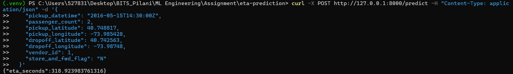

**Figure 8 — Valid Batch Prediction:**

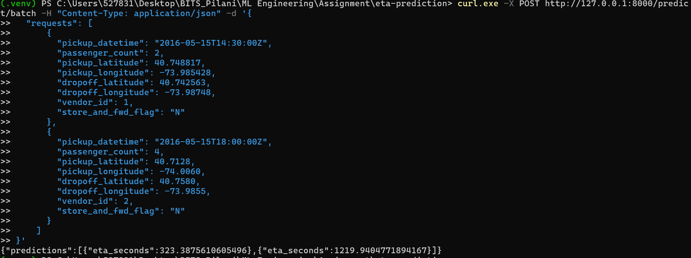

**Figure 9 — Invalid Input (HTTP 422):**

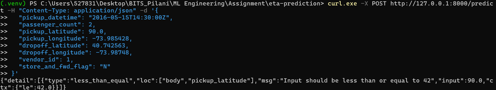

### 5.3 Model Loading

- **`src/serving/model_loader.py`** reads `models/champion.json` at startup
- Loads `models/serving/model.pkl` via `joblib.load()`
- Lazy loading via FastAPI lifespan events (loads once on startup)
- Model type from champion metadata determines routing (LightGBM currently)

### 5.4 Docker Containerization

**`docker/Dockerfile.api`** — Multi-stage build:

1. Build stage: install dependencies, copy code and model
2. Runtime stage: slim Python image, non-root user

**`docker/docker-compose.yml`** — Two services:

- `eta-api`: FastAPI + uvicorn on port 8000
- `mlflow`: MLflow UI on port 5000

```bash
docker compose -f docker/docker-compose.yml build
docker compose -f docker/docker-compose.yml up -d
```

**Figure 10 — Docker Compose Running:**

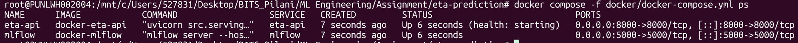

### 5.5 Test Coverage (`tests/test_api.py`)

**16 tests, all pass:**

| Category | Tests | Result |
| ---------- | ------- | -------- |
| Valid single prediction | 1 | ✅ Pass |
| Deterministic output (same input → same ETA) | 1 | ✅ Pass |
| ETA within training bounds | 1 | ✅ Pass |
| Valid batch prediction | 2 | ✅ Pass |
| Invalid coordinates (out of range lat/lon) | 2 | ✅ Pass (422) |
| Missing required field | 1 | ✅ Pass (422) |
| Invalid passenger count | 1 | ✅ Pass (422) |
| Invalid vendor ID | 1 | ✅ Pass (422) |
| Pickup datetime missing timezone | 1 | ✅ Pass (422) |
| Invalid store_and_fwd_flag | 1 | ✅ Pass (422) |
| Negative longitude (edge case) | 1 | ✅ Pass (422) |
| Batch exceeds max | 1 | ✅ Pass (422) |
| Health check | 1 | ✅ Pass |
| Model info | 1 | ✅ Pass |

**Figure 11 — pytest Test Report:**

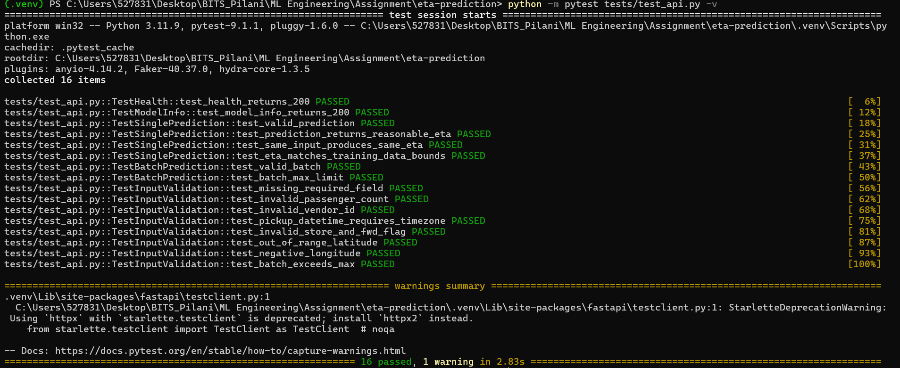

### 5.6 Latency & Throughput

Latency was measured by running `traffic_simulator.py` with 1000 requests (`--scenario suburban`) against the live FastAPI server:

| Metric | Value |
| ------- | ----: |
| **Avg Latency** | 19.5ms |
| **P95 Latency** | 24.4ms |
| **Max Latency** | 67.2ms |

- **Model size:** LightGBM champion is lightweight (< 50 MB), enabling fast cold starts
- **Batch endpoint:** `/predict/batch` supports up to 100 trips per request, improving throughput for bulk callers
- **Throughput note:** ~51 req/s average single-prediction throughput (1000 requests / 19.5ms avg). The `/predict/batch` endpoint serves up to 100 trips per HTTP call, achieving ~5,100 predictions/s effective throughput for bulk callers.

**Implementation:** `src/monitoring/monitor.py`, `src/serving/api.py`

---

## 6. Monitoring & Drift Detection

### 6.1 Prediction Logging

Every prediction through `/predict` or `/predict/batch` is logged to `data/monitoring/production_logs.jsonl`:

| Field | Description |
| ------- | ------------- |
| `pickup_datetime` | Trip start time |
| `coordinates` | Pickup/dropoff lat/lon |
| `passenger_count` | Passengers |
| `vendor_id` | Vendor |
| `eta_seconds` | Model prediction |
| `latency_ms` | Inference time |

**Design note:** Production logs are **prediction-time records** (features + prediction). They do **not** include the final trip outcome (ground-truth duration), which arrives hours after prediction.

**Figure 12 — Production Log Sample:**

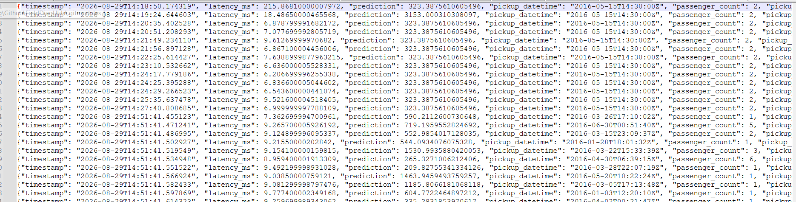

### 6.2 Drift Detection with Evidently AI

**Approach:** Compare feature distributions of recent production logs against `X_train.parquet` using Kolmogorov-Smirnov tests (per feature).

**How it works:**

1. Load recent production logs from `production_logs.jsonl`
2. Transform through the same `feature_pipeline.py` (ensures apples-to-apples comparison)
3. Run Evidently AI's `DataDriftPreset` + `DataSummaryPreset` against training features
4. Generate `reports/drift/drift_report.html` with per-feature PSI scores
5. Evaluate drift severity: if ≥ 30% of features show drift → **RETRAIN NEEDED**

**Figure 13 — Traffic Simulation Output:**

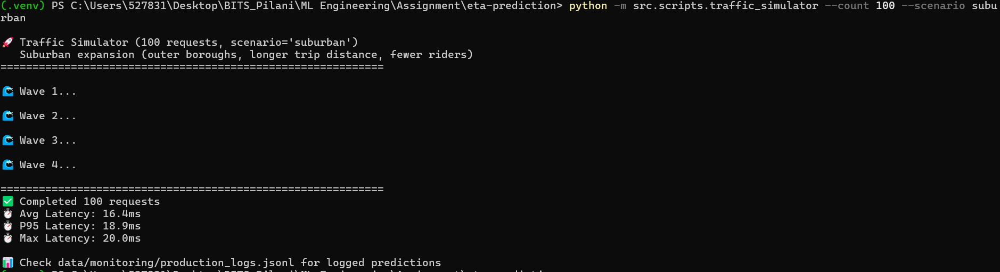

**Figure 14 — Evidently Drift Report (HTML):**

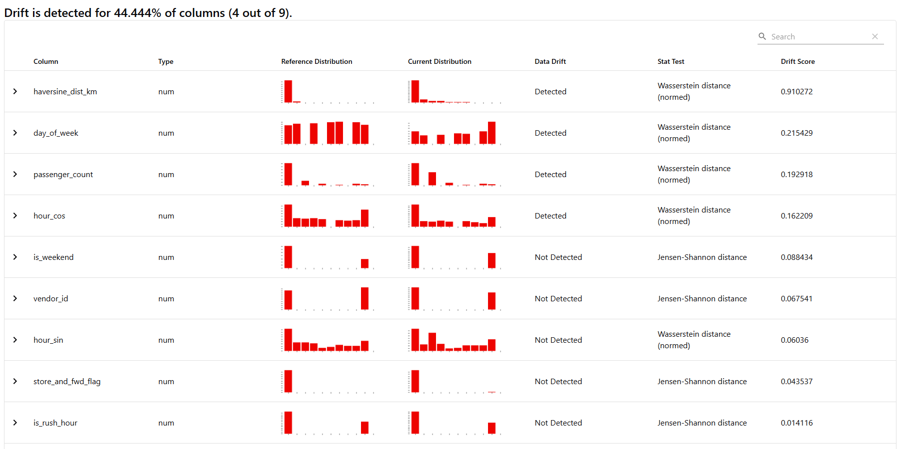

**Figure 15 — Drift CLI Decision Summary:**

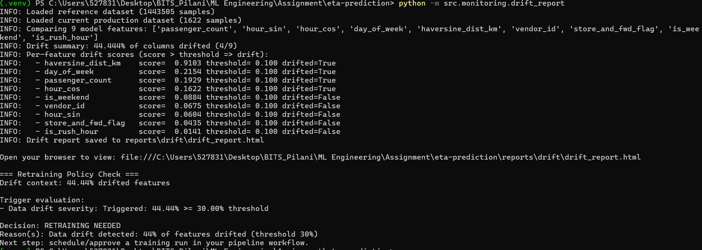

### 6.3 Drift Scenarios

`src/scripts/traffic_simulator.py` generates controlled traffic against the running API:

| Scenario | Description | Expected Drift Pattern |
| ---------- | ------------- | ---------------------- |
| `normal` | Historical baseline (sampled from training data) | Low (~0-10%) |
| `suburban` | Outer boroughs, longer trip distances, fewer riders | Moderate (spatial drift) |
| `rush` | Extended peak-hour (6–11 AM, 4–9 PM), longer distances | High (temporal drift) |
| `holiday` | Weekend-heavy, short local trips, single passengers | High (behavioral drift) |

All scenarios default to seed 42. Use `--seed` to override.

### 6.4 Why Feature Drift (Not MAE)?

| Drift Type | Detection Method | Feasibility |
|------------|------------------|-------------|
| **Feature (Input) Drift** | Compare live feature distributions against training data | ✅ Implemented — available at prediction time |
| **Concept (Performance) Drift** | Compare live MAE against baseline MAE | ❌ Out of scope — ground-truth durations arrive hours after prediction |

We track **feature distribution drift** because it's the only signal available at prediction time. If the distribution of incoming trips shifts away from what the model was trained on, prediction quality will degrade — even if we can't measure MAE yet.

**Why Evidently AI?**

- Statistically grounded: uses Kolmogorov-Smirnov tests per feature
- Tree-model aware: LightGBM relies on feature distributions for split decisions; distribution shifts directly affect split effectiveness
- Feature-space alignment: production logs transformed through `feature_pipeline.py` before comparison (exact features the model consumes)
- Visualization: interactive HTML report with per-feature drift scores

**Why 30% drift threshold?**

- Low enough to catch meaningful multi-dimensional shifts (10% is too sensitive — daily variance in one feature)
- High enough to avoid false positives (50% is too permissive — misses subtle spatial/temporal drift)
- Retraining is expensive; 30% ensures the signal is substantial before recommending a retrain

### 6.5 Expected Drift Severity by Scenario

| Scenario | Estimated Drift Severity | Trigger Retraining? |
| --- | --- | --- |
| `normal` | 0–10% | ❌ No |
| `suburban` | 15–25% | ⚠️ Monitor closely |
| `rush` | 30–45% | ✅ Yes (temporal shift) |
| `holiday` | 35–50% | ✅ Yes (behavioral + spatial shift) |

### 6.6 Expected Drift Patterns in Domain

NYC taxi demand is inherently non-stationary:

| Category | Source | Affected Features |
| --- | --- | --- |
| **Temporal** | Holidays, weather, construction | `hour_sin`, `hour_cos`, `is_rush_hour` |
| **Spatial** | New transit lines, event venues | `haversine_distance`, `pickup_bearing` |
| **Behavioral** | Ride-hailing adoption changes | `passenger_count`, `vendor_id` |

---

## 7. Retraining Strategy

### 7.1 Current Implementation

The monitoring pipeline is designed as a **drift detection and retraining recommendation system** — it detects drift and emits a clear decision signal, but does **not** execute retraining automatically.

| Signal | Condition | Threshold |
|--------|-----------|-----------|
| **Drift Detected** | ≥ 30% of features show distribution shift | `DRIFT_SEVERITY_THRESHOLD = 0.30` |
| **No Drift** | Drift share below threshold | `< 30%` |

**Workflow when drift is detected:**

1. CLI prints **RETRAINING NEEDED** with drift severity and reasons
2. Operations team reviews the drift report (`reports/drift/drift_report.html`)
3. Retraining, model promotion, and deployment are handled as a separate approved workflow

### 7.2 Design Constraints

- **No automatic retraining:** Intentionally designed as a monitoring/alerting system. Training execution is a separate approved workflow (prevents uncontrolled model churn).
- **MAE is a delayed signal:** Ground-truth trip durations are not available at prediction time. Online MAE gating is intentionally excluded. Offline MAE evaluation (from labeled outcomes) can serve as an additional trigger once labels become available.
- **Single decision dimension:** Current implementation relies solely on feature distribution drift. Production systems would layer performance decay, label-based quality gates, and cooldown windows on top.

### 7.3 Future Retraining Workflow (Production Design)

In a production deployment, the retraining workflow would be:

1. **Trigger:** Drift ≥ 30% detected (or scheduled weekly evaluation)
2. **Data:** Retrain on rolling/expanding window (e.g., last 6 months including drifted data)
3. **Training:** Same pipeline (`train.py --model all`) with MLflow tracking
4. **Validation:** New candidate must beat current champion on held-out validation set by ≥ 5% MAE
5. **Promotion:** `registry.py` updates `champion.json` + `model.pkl`
6. **Deployment:** Restart API container with new champion
7. **Cooldown:** 7-day minimum between retraining events (prevents churn)

---

## 8. Design Decisions & Justifications

| Decision | Choice | Justification |
| ---------- | -------- | --------------- |
| **Champion model** | LightGBM | Best MAE (244.92s), faster inference, lower memory vs XGBoost/CatBoost |
| **Train/validation split** | Chronological 80/20 | No future-data leakage; matches production deployment pattern |
| **Data contract** | `src/contract.py` shared across validation, training, and serving | Zero train-serving skew (single source of truth) |
| **Drift detection** | Evidently AI (feature drift via KS tests) | Only signal available at prediction time; statistically grounded |
| **Retraining trigger** | Drift ≥ 30% of features → recommendation | Balances sensitivity (10% too noisy) and false positives (50% too permissive) |
| **MLflow backend** | SQLite (local) | No long-running server needed; `mlflow.db` ignored by Git |
| **DVC tracking scope** | Processed features + models only | Raw CSV is source data (downloaded), not pipeline output |
| **API framework** | FastAPI + Pydantic | Automatic validation, auto-generated Swagger docs, async support |
| **Docker deployment** | Multi-stage Dockerfile + Docker Compose | Reproducible container; two-service compose for API + MLflow UI |
| **Random seed** | Global seed 42 (`src/reproducibility.py`) | Reproducible experiments across runs |
| **Optuna hyperparameter tuning** | 10 trials × 2 models (LightGBM + XGBoost) | Minimal param space (`n_estimators`, `max_depth`, `learning_rate`); wall-clock ~3-5 min |
| **Cyclical time encoding** | `hour_sin`/`hour_cos` | Preserves circular continuity of hours (23 ↔ 0) |

---

## 9. Deviations from Standard Pipeline

| Item | Standard Approach | Our Decision | Why |
| ------ | ------------------- | -------------- | ----- |
| DVC remote | Cloud/local remote | Skipped | No cloud budget; local `.dvc` pointers sufficient |
| Retraining execution | Auto-retrain on trigger | Drift-only recommendation | Monitoring/alerting scope; training is separate workflow |
| Raw data DVC tracking | `dvc add NYC.csv` | Manual download + `.gitignore` | Source data; each member downloads from Kaggle |
| MLflow server | Dedicated tracking server | SQLite local backend | Assignment scope; no long-running server required |
| Ensemble models | Stack/average top models | Single LightGBM champion | ~0.1-0.3% MAE gain vs triple serving complexity |

---

## 10. End-to-End Execution Commands

```bash
# ── 1. Setup & DVC Init ─────────────────────────────────────
python -m pip install -r requirements.txt
dvc init

# ── 2. Data Validation ──────────────────────────────────────
python -m src.data.validate

# ── 3. Feature Pipeline ─────────────────────────────────────
python -m src.data.preprocess

# ── 4. DVC Track Processed Data ────────────────────────────
dvc add data/processed/X_train.parquet data/processed/y_train.parquet models/feature_pipeline.pkl
git add data/processed/*.dvc models/*.dvc data/contracts/feature_registry.json
git commit -m "feat(dvc): versioned dataset slice"

# ── 5. Train Models ────────────────────────────────────────
python -m src.models.train --model all

# ── 6. Select & Promote Champion ───────────────────────────
python -m src.models.compare --metric mae
python -m src.models.registry

# ── 7. DVC Track Champion Model ────────────────────────────
dvc add models/serving/model.pkl
git add models/serving/model.pkl.dvc models/champion.json
git commit -m "feat(model): promote champion serving artifact"

# ── 8. Serve & Test ────────────────────────────────────────
python -m uvicorn src.serving.api:app --reload
python -m pytest tests/test_api.py -v

# ── 9. Simulate Traffic & Detect Drift ─────────────────────
python -m src.scripts.traffic_simulator --scenario suburban --count 100
python -m src.monitoring.drift_report
```

---

## 11. References & Citations

**Dataset:**

- NYC Taxi Trip Duration by Yasser H. ([Kaggle](https://www.kaggle.com/datasets/yasserh/nyc-taxi-trip-duration))

**Key Libraries:**

| Library | Purpose |
| --- | --- |
| [scikit-learn](https://scikit-learn.org/) (v1.9.0) | Ridge baseline model, preprocessing utilities, model evaluation metrics |
| [XGBoost](https://xgboost.ai/) (v3.2.0) | Gradient boosting model candidate |
| [LightGBM](https://lightgbm.readthedocs.io/) (v4.7.0) | Gradient boosting champion model |
| [CatBoost](https://catboost.ai/) (v1.2.10) | Gradient boosting model candidate |
| [pandas](https://pandas.pydata.org/) (v2.3.3) + [pyarrow](https://arrow.apache.org/) (v25.0.0) | Data manipulation and Parquet I/O |
| [FastAPI](https://fastapi.tiangolo.com/) (v0.141.1) + [Pydantic](https://docs.pydantic.dev/) (v2.13.4) | REST API, request validation |
| [MLflow](https://mlflow.org/) (v3.15.1) | Experiment tracking, parameter/metric logging |
| [DVC](https://dvc.org/) (v3.67.1) | Data and model versioning |
| [Evidently AI](https://docs.evidentlyai.com/) (v0.7.21) | Feature drift detection and reporting |
| [Optuna](https://optuna.org/) (v4.9.0) | Hyperparameter optimization |
| [pytest](https://docs.pytest.org/) (v9.1.1) + [httpx](https://www.python-httpx.org/) (v0.28.1) | API integration testing |
| [uvicorn](https://www.uvicorn.org/) (v0.52.1) | ASGI server for FastAPI |

**Course:** ML Engineering (PCAMZC412), BITS Pilani, WILP

---

## 12. Future Improvements

| Area | Improvement | Priority |
| --- | --- | --- |
| **Ground-truth feedback** | Capture actual trip duration hours later → compute online MAE | High |
| **Concept drift** | Add MAE-based trigger alongside feature drift detection | High |
| **Auto-retrain** | Trigger `train.py` pipeline when threshold crossed | Medium |
| **A/B testing** | Run champion and candidate models in parallel for safe promotion | Medium |
| **Alerting** | Integrate drift alerts with email/Slack notifications | Low |
| **DVC remote** | Configure cloud DVC remote for collaborative data sharing | Low |
